# Carbon Element Video | Multi-Platform Video Content Service

[简体中文](./README.md) | [Privacy Policy](./PRIVACY.en.md) | [Publishing Guide](./PUBLISHING.en.md) | [Changelog](./CHANGELOG.en.md)

  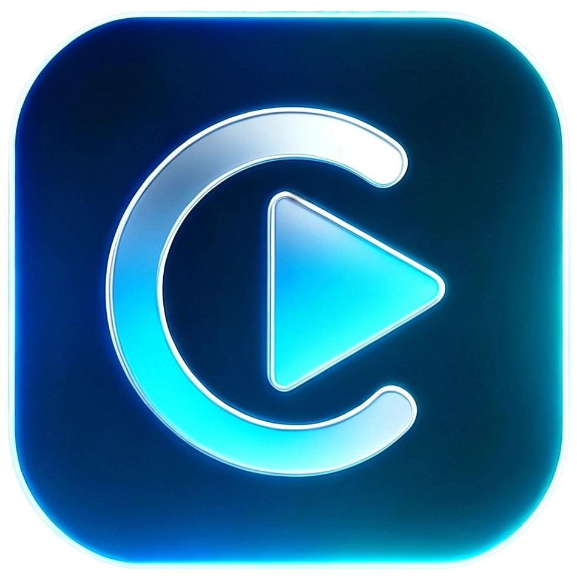

Carbon Element Video is a video content browsing, playback, watchlist, and community service designed around a shared platform architecture. The product consists of a mobile client, an operations console, content ingestion services, and backend APIs. The architecture is designed to support additional clients over time.

The currently public client is **Android**. This repository is the public release and product-information repository. It contains release notes, installation files delivered through GitHub Releases, privacy information, and public media assets. Source code, backend code, databases, signing materials, and credentials are not published here.

## Download and Install

Download the latest `carbon-element-video-v*.apk` from [Releases](https://github.com/520boys/carbon-element-video-release/releases).

1. Download the latest Android APK.
2. Allow installation from the current source when Android requests permission.
3. Open Carbon Element Video and complete the first-run setup.

Only download packages from this repository's official Releases page. Verify the SHA-256 checksum listed in each release before installing.

## Product Screenshots

  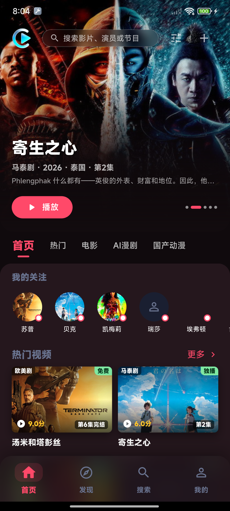
  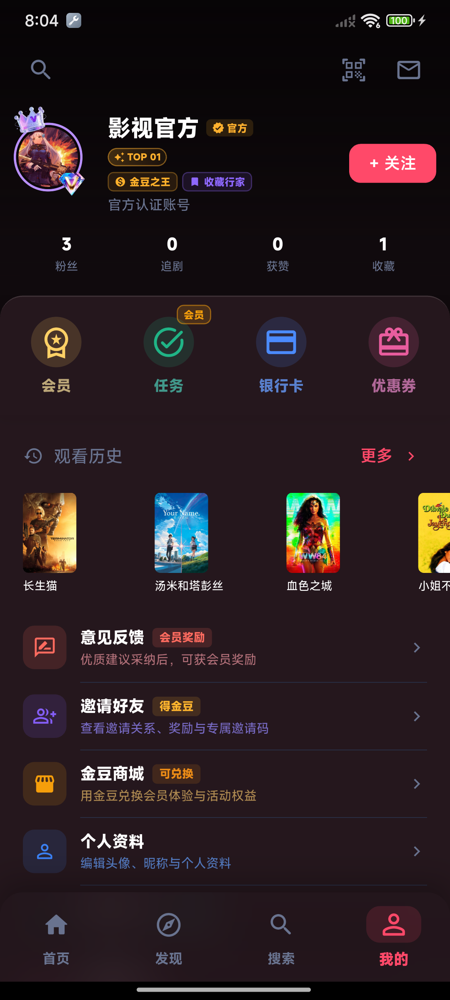
  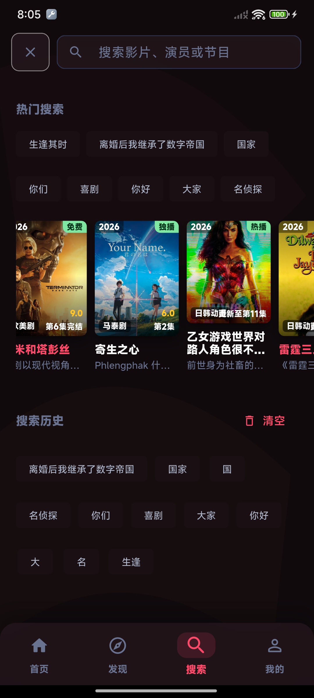

  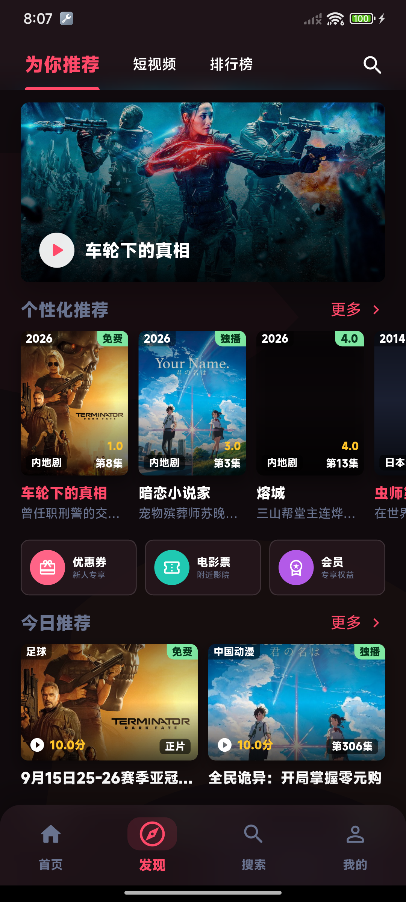
  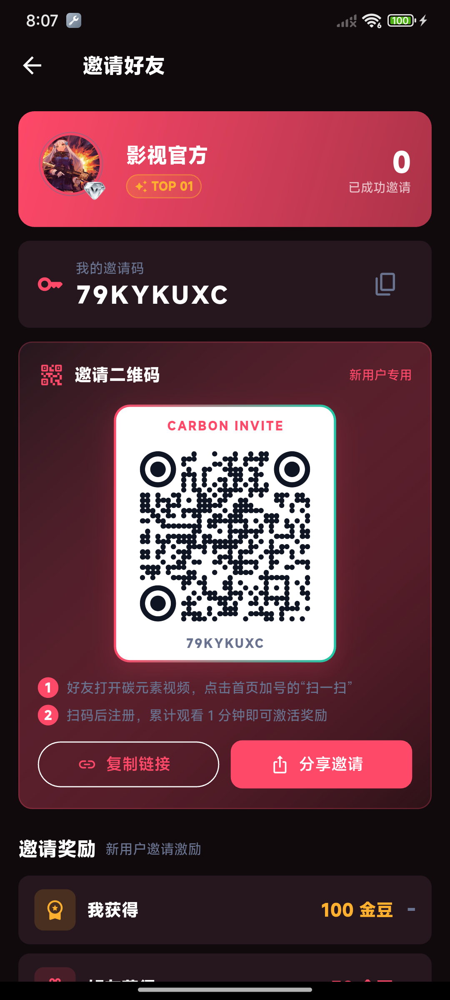
  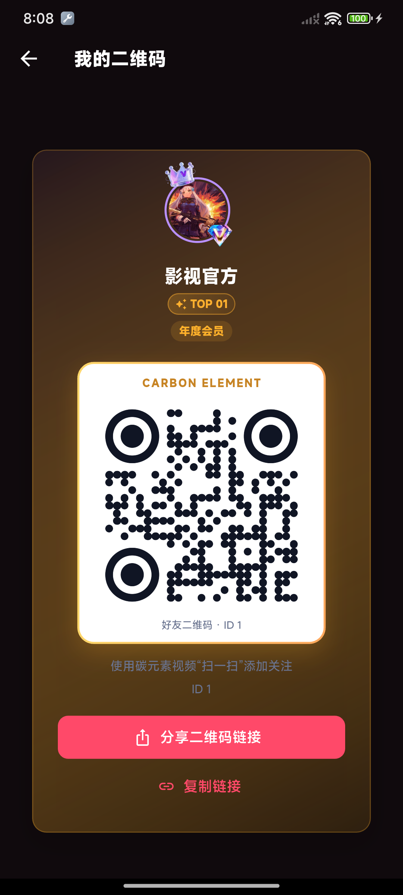
  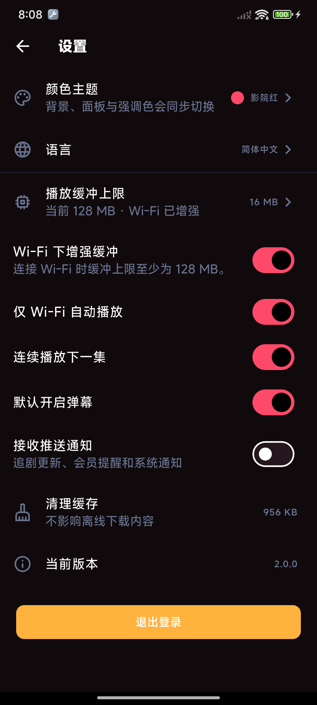

  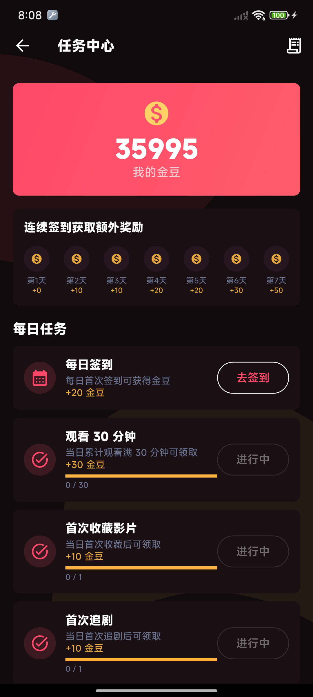
  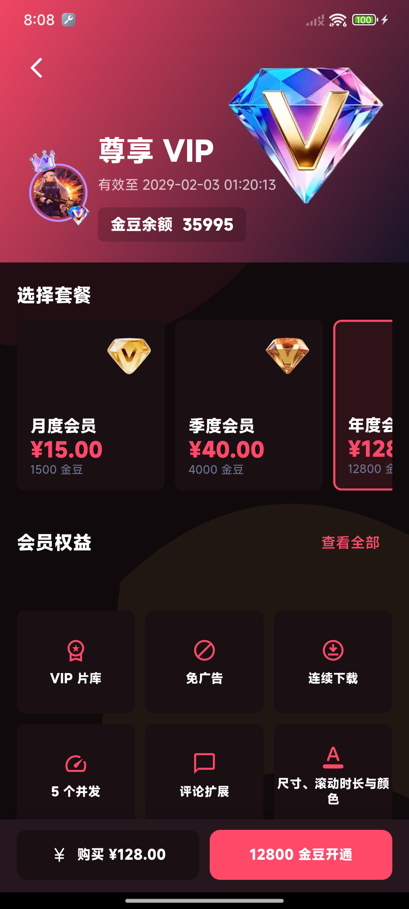
  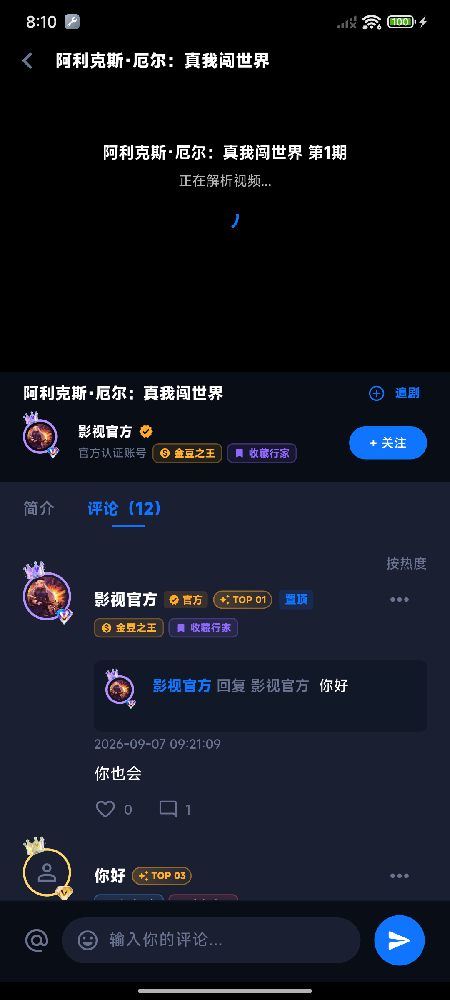

## Technology Stack

| Area | Technology | Purpose |
| --- | --- | --- |
| Android app | Flutter, Dart, Material, MediaKit | Browsing, playback, danmaku, comments, downloads, membership, tasks, QR codes, and local cache. |
| Operations console | Vue 3, TypeScript, Vite, Element Plus, Pinia, ECharts | CoolAdmin Vue-based management for content, users, memberships, operations, and ingestion tasks. |
| Backend | Node.js, TypeScript, CoolAdmin Midway, Koa, TypeORM | App APIs, operations APIs, scheduled tasks, permissions, and business services. |
| Data | MySQL, TypeORM | Movies, episodes, playback sources, user interactions, memberships, gold credits, invitations, and operations data. |
| Content ingestion | Apple CMS JSON/XML, fast-xml-parser | Source synchronization, category mapping, ingestion, duplicate merging, and playback-source management. |
| Android delivery | EMAS Push, Android Gradle, GitHub Actions | Device notifications, signed builds, versioned APKs, and public release automation. |

Android is the only publicly released client at this time. Web and iOS are architectural plans and are not publicly available clients.

## Capabilities

- Configurable home navigation, banners, rankings, recommendations, and content sections
- Category filters, search, watch history, resume playback, watchlists, favorites, and follow relationships
- Multi-source playback, episode selection, capability display for quality, subtitles, and audio tracks
- Danmaku, comments, threaded replies, likes, reports, and feedback workflows
- Membership entitlements, daily tasks, check-ins, gold-credit ledger, exchange store, and invitation rewards
- Offline download queues, Wi-Fi policies, cache management, and membership download limits
- Operations management for content, collection sources, users, memberships, notifications, reports, and growth campaigns

## Current Release Information

| Item | Value |
| --- | --- |
| Product name | Carbon Element Video |
| Current release platform | Android |
| Product positioning | Multi-platform video content service |
| Package name | `com.selfdeveloped.Cview` |
| Current version | `2.0.0+2` |

Machine-readable release metadata, download URLs, and checksums are available in [app-info.json](./app-info.json).

## Release and Compliance Notes

- APK and AAB binaries are uploaded as GitHub Release assets and are not committed to Git.
- Release tags match the Flutter version, for example `v2.0.0+2`.
- Available features and operational content may change with server-side configuration.
- Third-party content sources, artwork, and playback resources must be used only within the applicable authorization, regional, and legal requirements.

See [CHANGELOG.en.md](./CHANGELOG.en.md) for public release notes and [PRIVACY.en.md](./PRIVACY.en.md) for privacy information.
